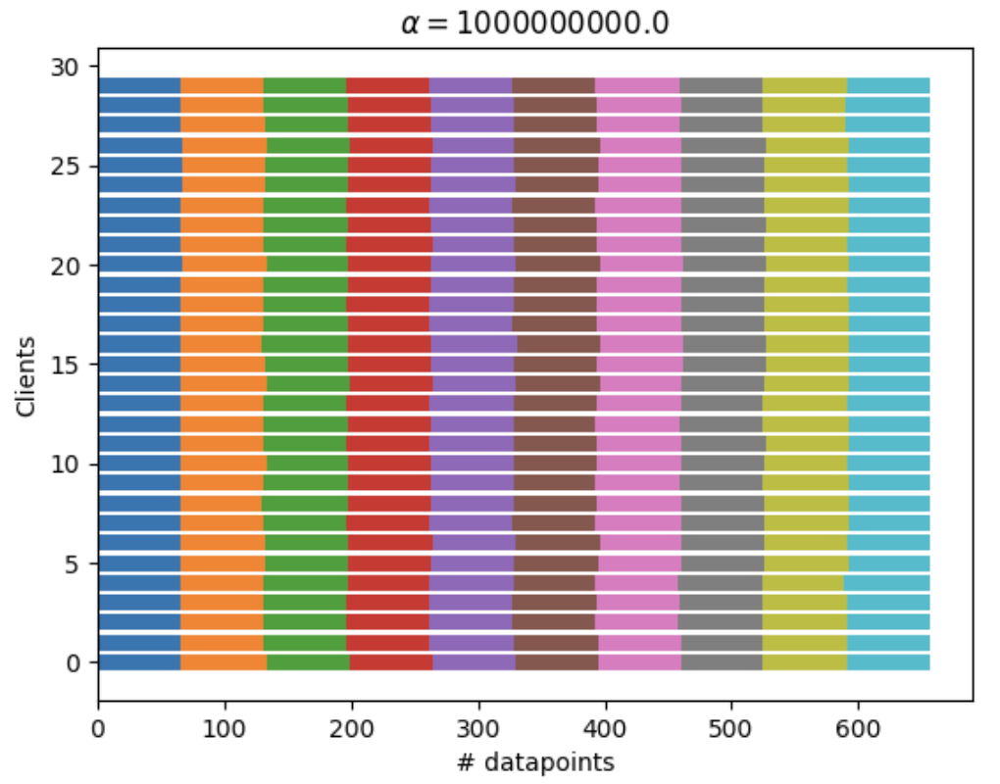
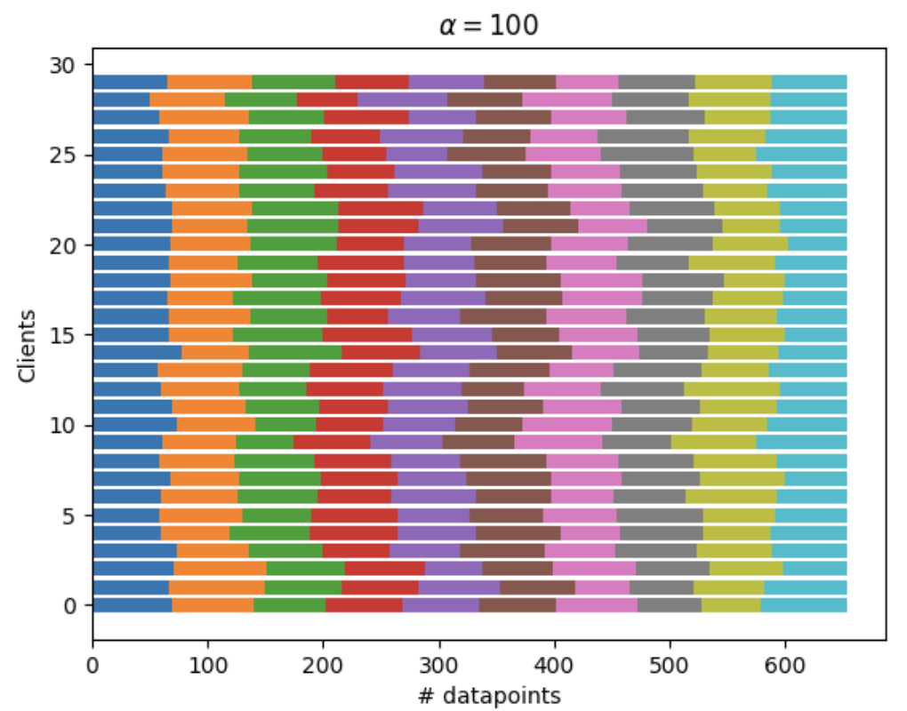
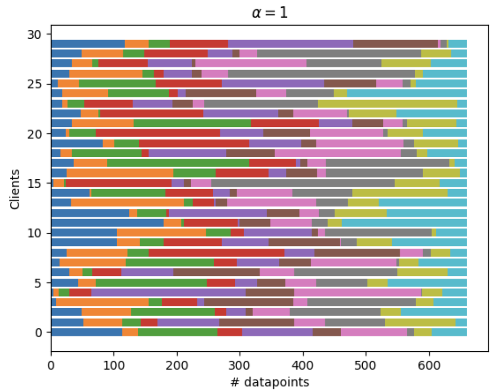
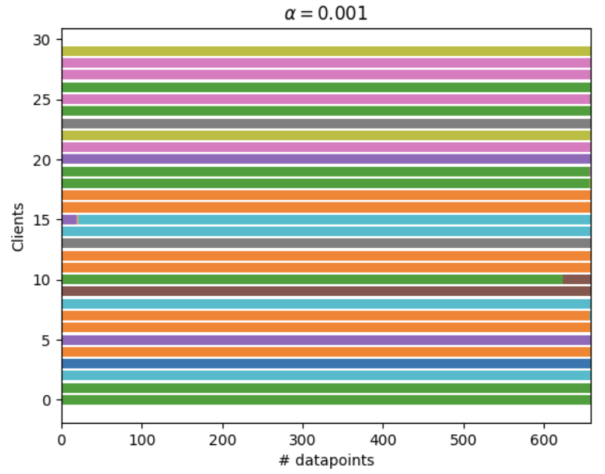
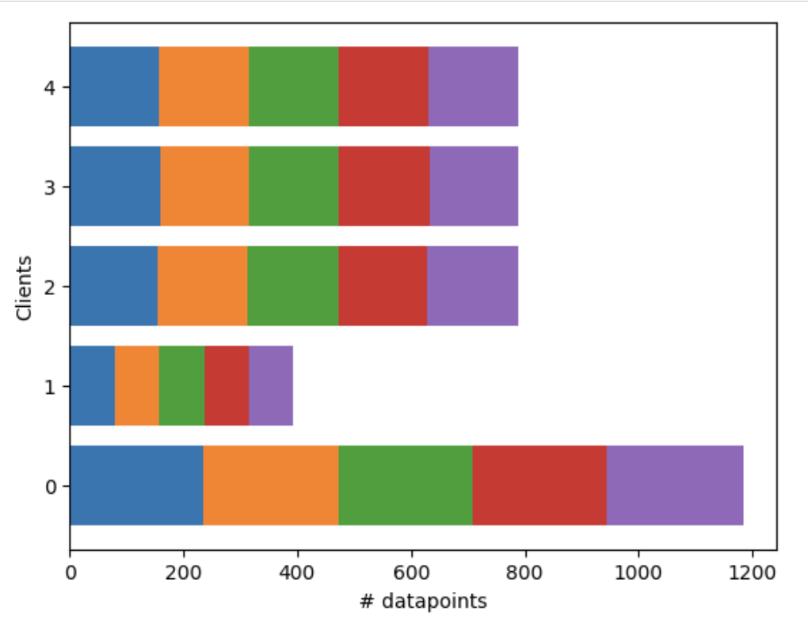
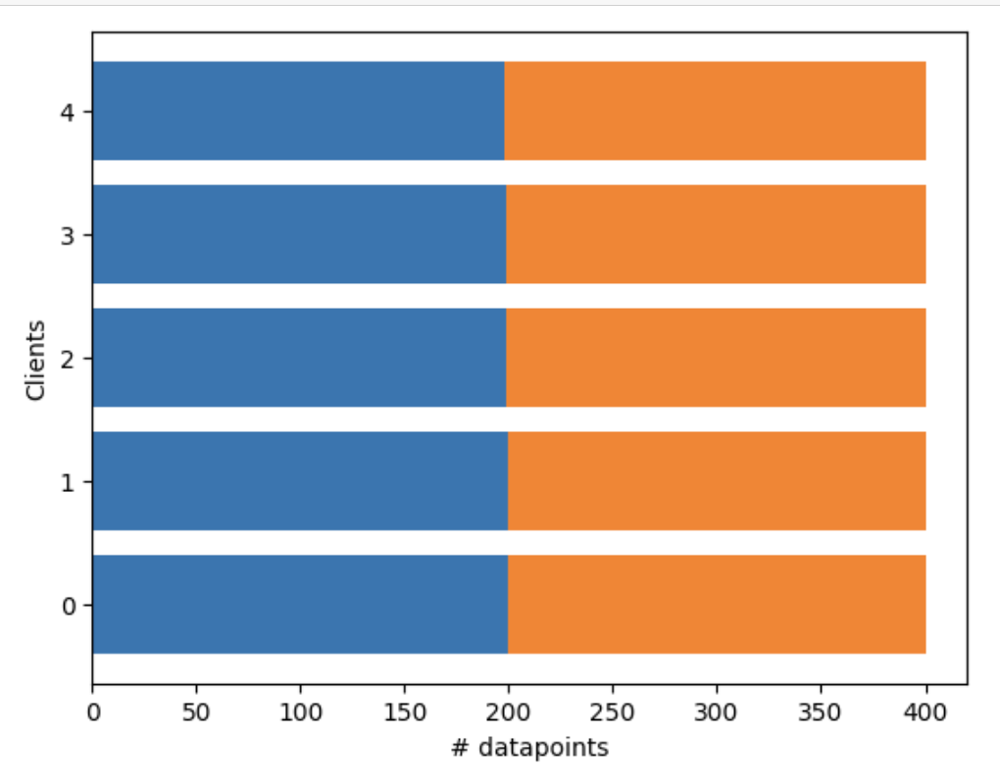

# Dirichlet Partitioning
A simple Python's Numpy implementation of Dirichlet Partitioning.

In trying to replicate Section 3 of the *Measuring the Effects of Non-Identical Data
Distribution for Federated Visual Classification* paper I implemented
a function that partitions an array of class labels using the [Dirichlet
distribution](https://en.wikipedia.org/wiki/Dirichlet_distribution) given a concentration
parameter (as I couldn't find the author's code). Thought it could be useful to others.

## Usage
```
import numpy as np
from dirichlet import dirichlet_partition

# An example of a class-balanced y
y=np.random.choice([0,1],size=10000,p=[0.5,0.5])

# Partitioned among 5 clients/segments with a high alpha
partition_indices=dirichlet_partition(y,c_clients=5,alpha=100,debug=True)

# partition_indices is now a dict. segment/client id -> y indices
# To get segment/client id -> values we can do
partition_values={i:y[indices] for i,indices in partition_indices.items()}

```

## Examples

We reproduce the figure in the paper [1]:
```
for alpha in [1e+9,100,1,0.001]:
    
    classes=list(range(10))

    # A class balanced y
    y=np.random.choice(classes,size=200000)

    # Partitioned among 5 clients/segments with a high alpha
    partition_ixs=dirichlet_partition(y,c_clients=30,alpha=alpha,debug=True)
    partition={c:y[ixs] for c,ixs in partition_ixs.items()}
    
    visualize_partition(partition,classes,title=r'$ \alpha = {'+str(alpha)+'} $')
```






You can also specify an uneven proportion of the number of examples per client:

```
# An example with uneven n
classes=list(range(5))

# A class balanced y
y=np.random.choice(classes,size=20000)

# Partitioned among 5 clients/segments with a high alpha
partition_ixs=dirichlet_partition(y,c_clients=5,alpha=10000,n=[0.3, 0.1, 0.2, 0.2, 0.2])
partition={c:y[ixs] for c,ixs in partition_ixs.items()}

visualize_partition(partition,classes)
```




The partitioning can also handle class-inbalanced ys (it will just result in less samples/client):

```
# An example dealing with uneven label distribution in y 

classes=list(range(2))

# A class un-balanced y
y=np.random.choice(classes,size=20000,p=[0.9,0.1])

# Partitioned among 5 clients/segments with a high alpha
partition_ixs=dirichlet_partition(y,c_clients=5,alpha=10000)
partition={c:y[ixs] for c,ixs in partition_ixs.items()}

# We are still able to guarantee the dist. given by alpha
visualize_partition(partition,classes)
```


The code used to produce examples is in the  `examples.ipynb` notebook.

## References
- Hsu, Tzu-Ming Harry, et al. Measuring the Effects of Non-Identical Data Distribution for Federated Visual Classification. arXiv, September 13, 2019. arXiv.org, [http://arxiv.org/abs/1909.06335](http://arxiv.org/abs/1909.06335).
